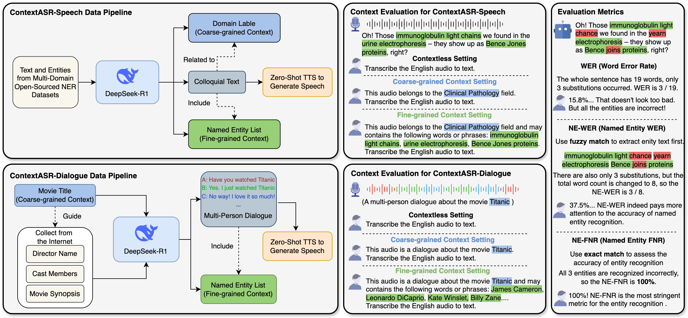

# ContextASR-Bench: A Massive Contextual Speech Recognition Benchmark  
<p align="center" dir="auto">
<a href="https://arxiv.org/abs/2507.05727" rel="nofollow"></a>
<a href="https://huggingface.co/datasets/MrSupW/ContextASR-Bench" rel="nofollow"></a>
</p>
Automatic Speech Recognition (ASR) has been extensively investigated, yet prior evaluative efforts have largely been restricted to contextless paradigms. This constraint stems from the limited proficiency of conventional ASR models in context modeling and their deficiency in memory and reasoning based on world knowledge. Recent breakthroughs in the development of Large Language Models (LLMs) and corresponding Large Audio Language Models (LALMs) have markedly enhanced the visibility of general artificial intelligence capabilities. Consequently, there exists a compelling need for a benchmark that can evaluate both the generality and intelligence of ASR systems. To address this gap, we propose ContextASR-Bench: a comprehensive, large-scale benchmark designed to assess contextual speech recognition. This benchmark encompasses up to 40,000 data entries across over 10 domains, enabling a thorough evaluation of model performance in scenarios that omit or incorporate coarse-grained or fine-grained contextual information. Moreover, diverging from conventional ASR evaluations, our benchmark includes an analysis of model efficacy in recognizing named entities mentioned within the auditory input. Our extensive evaluation highlights that LALMs, with strong world knowledge and context learning capabilities, outperform conventional ASR models by a large margin.  

## 🖥️ Overview of ContextASR-Bench
The below figure is an overview of our proposed ContextASR-Bench, comprising ContextASR-Speech and ContextASR-Dialogue, two distinct test sets. The left part shows the data pipeline for these two test sets. Both use DeepSeek-R1 to generate entity-rich corpora, which are then synthesized into speech using Zero-Shot TTS. Each entry in both sets follows the same data structure: &lt;**Audio**, **Text**, **Coarse-grained Context**, **Fine-grained Context**&gt;. The middle part presents three contextual evaluation settings. The contextless setting can be used for evaluating any ASR systems, while the other two assess LALMs' context comprehension capacity through different granularity information within the prompt. The right part introduces three evaluation metrics used in ContextASR-Bench. **NE-WER** and **NE-FNR** focus more on the accuracy of entity recognition compared to **WER**.  
<!--    -->
<div style="text-align: center;">
  <br/>
</div>

## 🗂️ Download ContextASR-Bench Data  
The ContextASR-Bench dataset is now available for download at [🤗Huggingface🤗](https://huggingface.co/datasets/MrSupW/ContextASR-Bench). 


## 📑 Evaluation Code  
The example evaluation code is provided in the `evaluation` folder.  
You can check the [`evaluation/README.md`](evaluation/README.md) file for more details.

## 📚 Citation
```
@article{wang2025asrbench,
      title={ContextASR-Bench: A Massive Contextual Speech Recognition Benchmark}, 
      author={He Wang and Linhan Ma and Dake Guo and Xiong Wang and Lei Xie and Jin Xu and Junyang Lin},
      year={2025},
      eprint={2507.05727},
      archivePrefix={arXiv},
      primaryClass={eess.AS},
      url={https://arxiv.org/abs/2507.05727}, 
}
```
